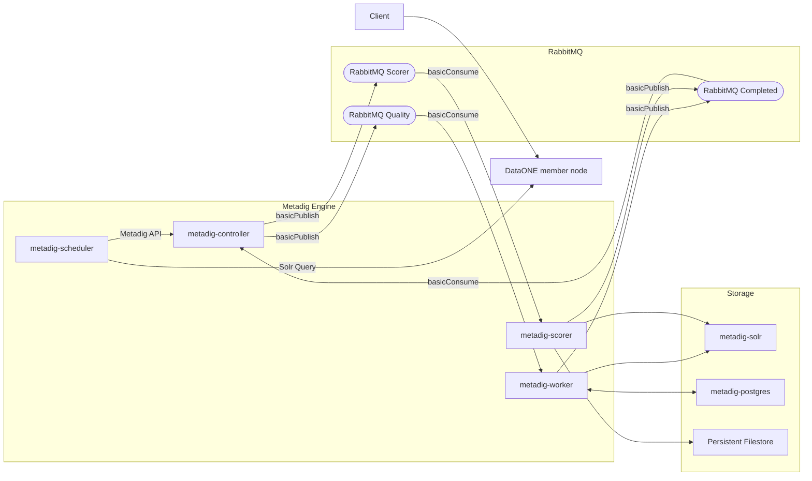
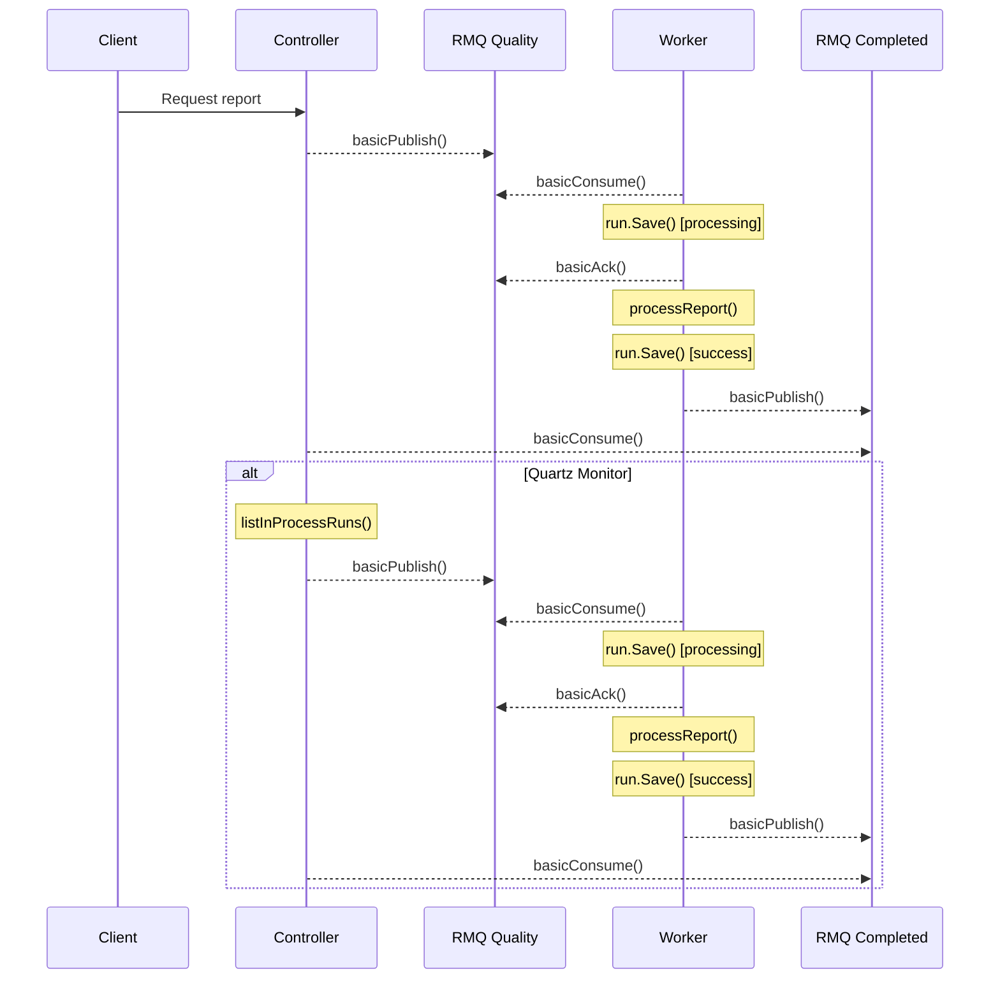

# MetaDIG Architecture Notes

This document outlines the system architecture for generating
metadata quality reports for holdings in DataONE Member Nodes.

## Design goals
* Scale number of workers so that member nodes are not overloaded
* Know the state of engine processing tasks
* Scalability to handle many parallel processing requests
* Deployable at MN or CN
* Admin can configure which suites are run
* Robust to failures and restarts of master and/or workers

## MetaDIG system components
* Metadig-controller: a controller for managing a pool of MetaDIG engines and a task 
queue
    * dependencies
        * metadig-engine
        * RabbitMQ
        * Tier 3 MN implementation supporting SOLR query engine (e.g., Metacat)
        * Docker Container Manager
            * Rancher: (https://rancher.com/)
            * Docker Kubernetes: https://www.docker.com/kubernetes
    * API
        * /tasks/{task_id}
        * API fronting RabbitMQ, allows external clients to push jobs into queue
        * Also need a monitor daemon that periodically pulls jobs from the MN list
        * /config/{param}
            * List of MN ID to be serviced, maybe baseURL too
            * List of suites to execute per formatID (or wildcard?)
    * State
        * RabbitMQ taskqueue, persistent across reboots
            * List of MetaDIGTask
        * Configuration state
        * tasklist.csv -- data structure describing a task, including
            * Metadata pid
            * Metadata formatid
            * Metadata access info (url, or other pointer like filesystem location)
            * Sysmeta access info (url, or other pointer like filesystem location)
            * Data access info ( (url, or other pointer like filesystem location)
            * Resource map and its sysmeta
    * metadig-r
        * R package used to author and test R quality tests
    * metadig-py
        * Python module used to author and test quality tests written in python
    * mdq-webapp:
        * The Apache Tomcat based webapp that accepts MetaDIG service requests and forwards
          them to metadig-controller

* metadig-scorer: creates graphs and CSV of aggregated quality scores and writes them to disk
	* creates graphs and CSV of aggregated quality scores and writes them to disk
	* dependencies
		* metadig-controller
	* API
		* POST
		    * requests that a graph is created for the specified aggregation type
		    * syntax: /graph?project=<id>&node=<nodeId>&suite=<name>&dialect=<name>
		        * example: /graph?project=urn:uuid:dddaa020-1038-4c34-a270-67a5a16e2f23
		    * parameters
		        * project: the project (collection) to create the graph for
		            * not required, no default
		        * node: the DataONE CN or MN id to obtain data from
		            * required, default: urn:node:CN
		        * suite: the quality suite id, e.g. "FAIR.suite.1"
		            * if not specified, default: FAIR.suite.1
		        * dialect: the metadata format family names, e.g. "iso19115, eml"
		            * required, no default
		    * Note that specifying a project causes the pids that are associated with that
		      project to be the set of pids included in the aggregation graph. If a project is
		      not specified, then all pids for a node are included, but filtered by dialect
		* GET
		    * retrieves a pre-generated graph
		    * syntax: /graph?project=<id>&node=<nodeId>&suite=<name>&dialect=<name>
		        * example: /graph?project=urn:uri:1234-4567
		    * parameters - same as POST
	* The following sequence diagram shows the events that occur during the generation of an
	accumulated metadata assessment graphic 

* metadig-scheduler: handles scheduling various jobs
    * dependencies:
        - metadig-engine
    * takes the items in taskList.csv and schedules by task type using quartz jobs running on cron triggers
    * task types
        - quality: Dataset quality scoring
        - score: Portal and member node scoring tasks
        - filestore: Task for ingesting files into the file store from /data/metadig/store/stage/{code,data,graph,metadata}
        - node list:  Node list from DataONE
        - download: Acquire data files that are used by assessment checks

* metadig-worker: runs quality jobs
    * dependencies:
        - metadig-engine
        - metadig-r
        - metadig-py
        - solr
        - postgres
        - rabbitMQ
    
## MetaDIG engine components

The following diagram shows the various components of the MetaDIG engine:

An older, more detailed, but less accurate, diagram is available [here](https://github.com/NCEAS/metadig-engine/blob/master/docs/images/metadig-engine_components.png)

## The following diagrams show message passing between the MetaDIG components:

* This sequence diagram showing how a job is popped off of the quality queue by a worker, added to the inprocess queue, processed by the worker, results saved to a Tier 3 node, and then the controller is told the job is complete.

* This sequence diagram shows how a trigger event on a MN or CN results in a job being added to the pending queue.

## The metadig-engine scheduler

* This sequence diagram shows how the scheduler determines which DataONE metadata documents to create quality reports for, then submits requests to metadig-engine to create the reports.

### Monitoring for stuck jobs

The controller launches a quartz job on a schedule configurable in the metadig.properties file to make sure that quality jobs don't get "stuck" in the processing state. This might happen if a worker unexpectedly dies mid-process, after acknowledging the RabbitMQ quality message, but before completing the task. The following sequence diagram shows how this process works. In this case the "Client" could either be a direct request from the API or (more likely) the scheduler.

## Metadata Assessment
## Metadata Quality Display Mockups
* The following display shows metadata quality summarized for all of DataONE:

* The following display shows metadata quality summarized for KNB:

* The following display shows metadata quality summarized for a DataONE user group:

