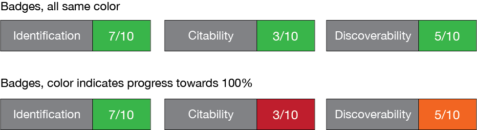
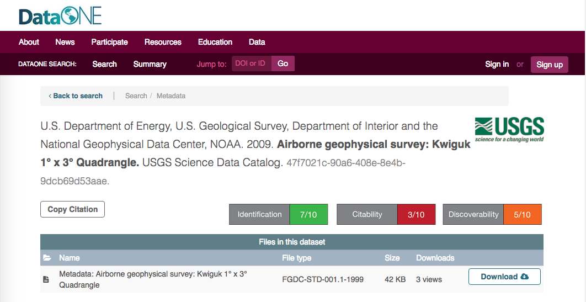
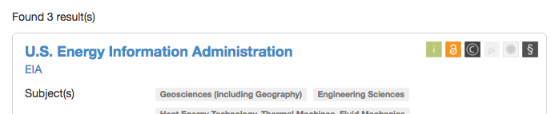

# Badge Mockups

Like you commonly see on open source code repositories hosted on GitHub, badges are used to indicate status towards certain objectives. Status is often a yes/no, ratio, or a percentage.

Another option would be something like the [re3data.org](re3data.org) badges:

These are very compact but I think we want something that is quicker to understand than an icon you have to hover over.
