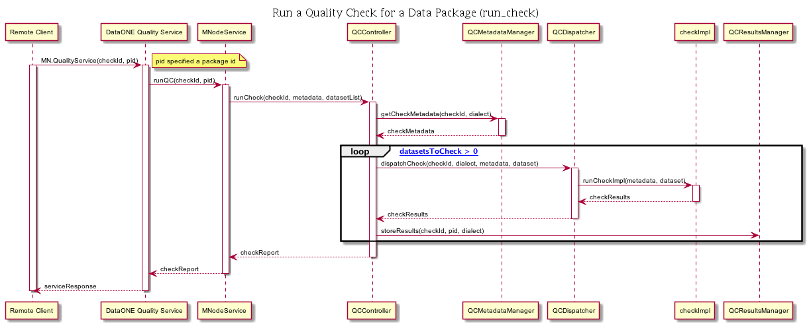

## Metadata Quality Check Use Case #4 (run_check)

### Goal

Run a single check against a provided data package

### Summary

A remote client requests that a specified quality check be performed on a data package (datasets and metadata) that has
already been uploaded to a data repository. If the data package exists in the repository, then the specified quality
check is run. The quality check results are stored in the repository and also returned to the remote client.

### Stakeholders
- Repository Manager

### Pre-Conditions
- The data package to check has been uploaded to the repository.
- The quality check has been registered with the metadata quality engine on the repository.
- The quality check has an implementation for the metadata dialect contained in data package that is being checked.

### Post Conditions
- Quality check results are stored on the repository for the requested data package, check and metadata dialect.
- A Quality Check report has been returned to the Remote Client.

### Trigger

A quality check request is sent to the DataONE Quality Service.

**Figure 1.** Sequence Diagram for Use Case 'run_check'

### Notes

